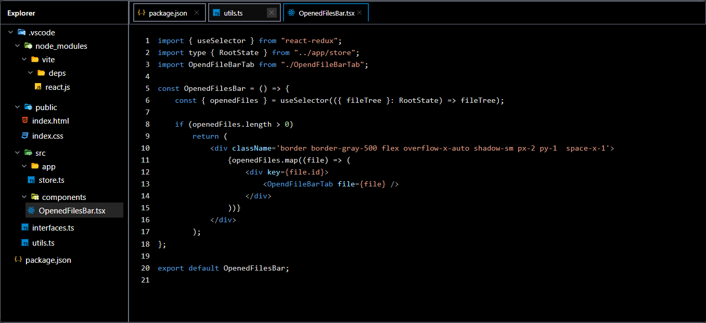

# VSCode Clone (vscode)

A modern, feature-rich Visual Studio Code clone built with React, TypeScript, and Vite. This project recreates the core functionality and visual design of VSCode with a focus on file exploration, syntax highlighting, and an intuitive user interface.

## Live Demo

[](https://vscode-ashen.vercel.app)

## Features

### File Explorer

- **File Tree**: Browse through a hierarchical file structure
- **Folder Expansion/Collapse**: Navigate folders with smooth animations
- **File Type Recognition**: Automatic detection and icon display for various file types
- **Dynamic Icons**: Context-aware icons for files and folders (open/closed states)

### File Management

- **Multi-Tab Interface**: Open multiple files simultaneously (max 5 tabs)
- **Tab Management**:
  - Click to switch between open files
  - Close individual tabs with close button
  - Right-click context menu for tab operations
  - Auto-removal of oldest tab when limit exceeded
- **File Content Display**: View file contents with proper formatting

### Code Editor Features

- **Syntax Highlighting**: Full syntax highlighting powered by `react-syntax-highlighter`
- **Line Numbers**: Display line numbers for better code navigation
- **VS2015 Dark Theme**: Professional dark theme matching VSCode aesthetics
- **Auto-scroll**: Smooth scrolling behavior throughout the application

### UI/UX Features

- **Resizable Panels**: Drag to resize explorer and editor panels
- **Responsive Design**: Adapts to different screen sizes
- **Custom Scrollbars**: Styled scrollbars with hover effects
- **Context Menus**: Right-click functionality for enhanced user interaction
- **Keyboard Accessibility**: Full keyboard navigation support

### State Management

- **Redux Toolkit**: Centralized state management for:
  - Opened files tracking
  - Active file selection
  - Tab management

## Tech Stack

### Core Technologies

- **React 19.1.0**: Latest React with modern features
- **TypeScript 5.8.3**: Full type safety and enhanced developer experience
- **Vite 7.0.4**: Lightning-fast build tool and development server

### Styling & UI

- **Tailwind CSS 4.1.11**: Utility-first CSS framework
- **CSS Custom Properties**: Dynamic theming and styling
- **React Resizable Panels 3.0.4**: Draggable panel layouts

### State Management

- **Redux Toolkit 2.8.2**: Modern Redux with simplified boilerplate
- **React Redux 9.2.0**: React bindings for Redux

### Code Features

- **React Syntax Highlighter 15.6.1**: Professional code highlighting
- **UUID 11.1.0**: Unique identifier generation for files

### Development Tools

- **ESLint 9.30.1**: Code linting and quality assurance
- **TypeScript ESLint**: TypeScript-specific linting rules
- **Vite Plugin React**: Hot module replacement and fast refresh

## Installation

```bash
# Clone the repository
git clone https://github.com/emanmohamedsr/vscode.git
cd vscode

# Install dependencies
npm install

# Start development server
npm run dev
```

## Available Scripts

```bash
# Development
npm run dev          # Start development server

# Building
npm run build        # Type check and build for production
npm run preview      # Preview production build

# Code Quality
npm run lint         # Run ESLint checks
```

## Project Structure

```
src/
├── app/
│   ├── store.ts                 # Redux store configuration
│   └── features/
│       └── fileTreeSlice.ts     # File management state
├── components/
│   ├── Explorer.tsx             # File explorer component
│   ├── Preview.tsx              # File content viewer
│   ├── FileComponent.tsx        # Individual file/folder component
│   ├── OpenedFilesBar.tsx       # Tab management bar
│   ├── FileSyntaxHighlighter.tsx # Code highlighting
│   ├── ResizablePanel.tsx       # Panel layout system
│   ├── SVG/                     # Custom SVG icons
│   └── ui/                      # Reusable UI components
├── constants/
│   └── index.ts                 # File type Mapping Icons
├── data/
│   └── index.ts                 # Mock file tree data
├── interfaces/
│   └── index.ts                 # TypeScript type definitions
├── styles/
│   └── index.ts                 # Shared style constants
└── utils/
    └── index.ts                 # Utility functions
```

## Supported File Types

The application recognizes and displays appropriate icons for:

- **Web Technologies**: HTML, CSS, JavaScript, TypeScript, JSX, TSX
- **Programming Languages**: Python, Java, C#, C++, Go, Rust, PHP, etc.
- **Configuration Files**: JSON, YAML, ENV, Docker, Makefile
- **Assets**: Images (PNG, JPG, SVG), Videos, Audio files
- **Documents**: PDF, Word, Excel, PowerPoint
- **Archives**: ZIP, TAR, GZ files
- **And many more...**

## Key Features Implementation

### File Tree Navigation

- Recursive component structure for nested folders
- Dynamic icon switching based on folder state
- Efficient state management for large file trees

### Tab System

- Intelligent tab limit management
- Context menu integration
- Active tab highlighting
- Auto-cleanup of inactive tabs

### Panel System

- Drag-to-resize functionality
- Persistent layout preferences
- Collapsible explorer panel
- Responsive breakpoints

## Contributing

1. Fork the repository
2. Create your feature branch (`git checkout -b feature/AmazingFeature`)
3. Commit your changes (`git commit -m 'Add some AmazingFeature'`)
4. Push to the branch (`git push origin feature/AmazingFeature`)
5. Open a Pull Request

## Acknowledgments

- Visual Studio Code team for the inspiration
- React community for amazing tools and libraries
- Contributors to open-source packages used in this project

---

## ScreenShots

### Main Interface


_The main VSCode clone interface showing the file explorer on the left and code editor on the right_

### Tab Management


_Multi-tab interface with syntax highlighted code and file icons_

### Resizable Panels


_Drag-to-resize functionality between explorer and editor panels_

### Context Menu


_Right-click context menu for tab operations (Close, Close All)_

**Built with ❤️ **
